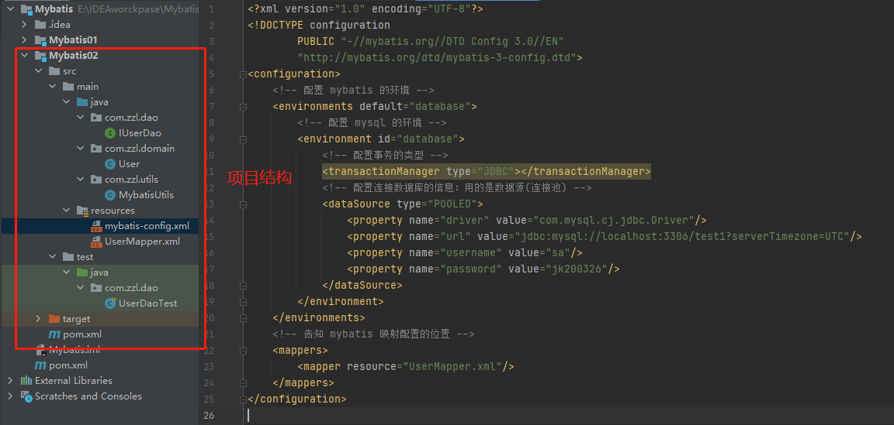
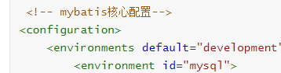

## 1、导入Maven依赖

```xml
    <!--导入Mybatis依赖-->
    <dependencies>
        <!--mysql驱动-->
        <dependency>
            <groupId>mysql</groupId>
            <artifactId>mysql-connector-java</artifactId>
            <version>8.0.18</version>
        </dependency>
        <!--mybatis-->
        <dependency>
            <groupId>org.mybatis</groupId>
            <artifactId>mybatis</artifactId>
            <version>3.5.2</version>
        </dependency>
        <!--junit-->
        <dependency>
            <groupId>junit</groupId>
            <artifactId>junit</artifactId>
            <version>4.12</version>
        </dependency>
    </dependencies>
```

+ 导入mysql驱动时先查看mysql版本

```hxml
mysql -V
```

## xxxxxxxxxx st=>start: 开始框 ​**op**=>operation: 处理框 ​cond=>condition: 判断框(是或否?) ​sub1=>subroutine: 子流程 ​io=>inputoutput: 输入输出框 ​e=>**end**: 结束框 ​st->**op**->cond ​cond(yes)->io->e​ cond(no)->sub1(right)->**op** flow Created with Raphaël 2.2.0开始框处理框判断框(是或否?)输入输出框子流程ERROR: [Flowchart] h.shiftX is not a function

项目结构



+ 2.1、mybatis核心配置文件==mybatis-config.xml==

```xml

```

- mysql8与Mysql5的连接不一样
  - mysql8
    - com.mysql.cj.jdbc.Driver
  - mysq5
    - com.mysql.jdbc.Driver

+ 2.2、映射文件==UserMapper.xml==

```xml
<?xml version="1.0" encoding="UTF-8"?>
<!DOCTYPE mapper
        PUBLIC "-//mybatis.org//DTD Mapper 3.0//EN"
        "http://mybatis.org/dtd/mybatis-3-mapper.dtd">
<!--namespace绑定一个dao/mapper接口-->
<mapper namespace="com.zzl.dao.IUserDao">
    <select id="getUserList" resultType="com.zzl.domain.User">
      select * from user
    </select>
</mapper> 
```

## 3、编写

+ 实体类：与数据库表字段一致

```java
    private int useid;
    private String usename;
    private String password;
```

+ Dao接口

```java
public interface IUserDao {
    List<User> getUserList();
}
```

4、异常

mybatis下opening session空指针异常

```java
```

核心配置文件的defalt和id要一致



修改

