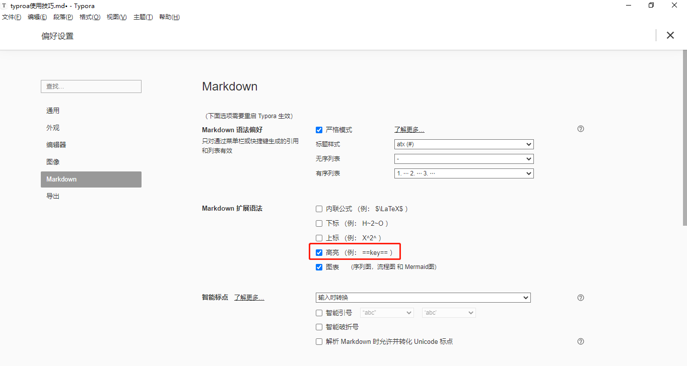
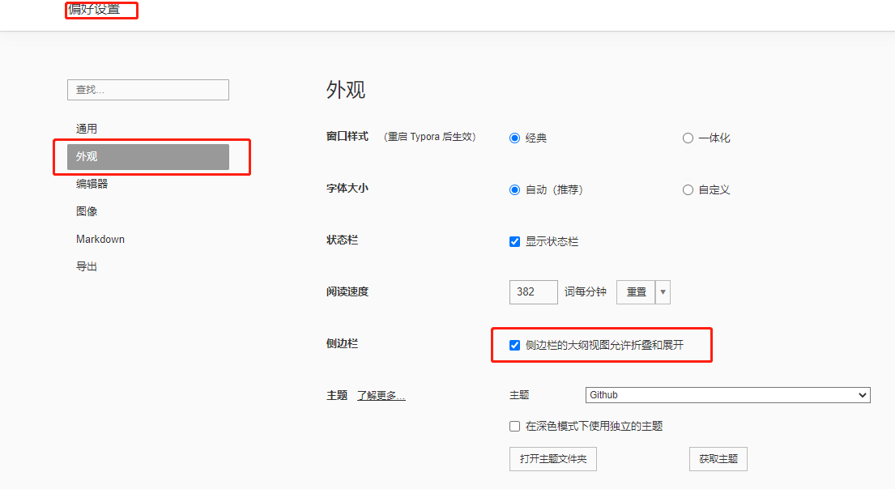

# 1.大纲：

Ctrl+1:一级标题

Ctrl+2:二级标题

# 2.高亮显示

关于高亮这个问题，有**代码高亮**和**文字高亮**：

+ 文字高亮：

  使用方法是在要高亮的文字前后加上`==`,如：==高亮显示==

+ 代码高亮：

  英文输入格式使用```+代码格式，如java格式高亮：

  ```java
  int a=1;
  ```

+ 设置：文件 -> 偏好设置（也可以快捷键：Ctrl+，）

​        Markdown -> Markdown扩展语法 -> 勾选高亮



# 3.列表

## 1.无序列表

`+`，`-`，`*`表示无序列表，前后留一行空白，可嵌套。如:

+ 一级
  - 二级
  - 二级
    * 三级
    * 三级
      * 四级
+ 一级

## 2.有序列表

`1. `点后面有空白，如：

1. 一级
   1. 二级
   2. 二级
2. 一级

# 4.大纲折叠标题

文件 -> 偏好设置（也可以快捷键：Ctrl+，）

外观 -> 侧边栏 -> 勾选



# 5.去除上一行格式

ctrl+[

# 6.插入代码块

ctrl+Shift + K

# 7.格式化代码块

Shift + Tab


# 8.加粗

ctr+b

